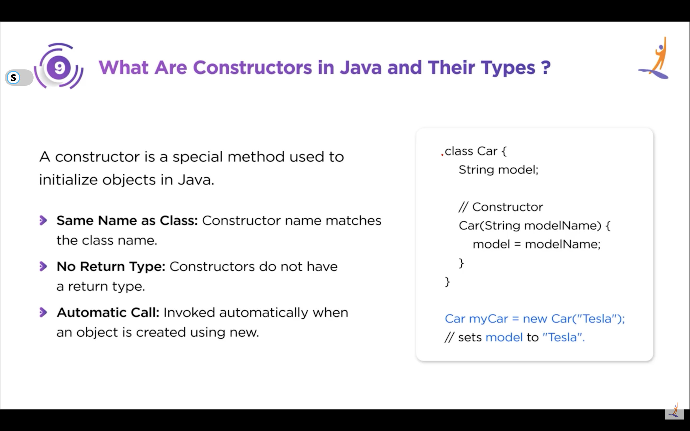

# ☕ Java Important Questions & Answers

## ❓ Q1: What is Java? And why is it not considered a pure object-oriented programming language?

**💡 Answer:**
Java is a high-level, object-oriented, platform-independent programming language. It follows the **Write Once, Run Anywhere (WORA)** principle using the JVM.

### 📌 Java Features:
- 🧩 **Object-Oriented**
- 🔒 **Secure**
- 🧵 **Multi-threaded**
- 🌍 **Platform Independent (JVM)**
- 🛡️ **Robust & Memory managed (Garbage Collection)**
- 📱 **Widely used** in backend, Android, banking systems

### 👉 Why not pure OOP?
Because Java allows **primitive data types** (`int`, `float`, `char`, `boolean`, etc.) for performance reasons. A pure OOP language (like Smalltalk) treats *everything* as an object.

```java
int x = 10;   // Primitive, NOT an object
```

> **Note:** Wrapper classes (`Integer`, `Float`) exist as a workaround, but the existence of primitives and static methods (which can be accessed without an object) violates strict OOP rules.

---

## ❓ Q2: Explain the key components involved in running a Java program.

**💡 Answer:**
A Java program compiles with the **JDK compiler**, produces **bytecode**, and is executed by the **JVM** inside the **JRE**, making Java platform-independent and secure.

### 🛠️ Components:
1.  **JDK (Java Development Kit)**: Contains JRE + development tools (compiler, debugger).
2.  **JRE (Java Runtime Environment)**: Contains libraries and files JVM uses at runtime.
3.  **JVM (Java Virtual Machine)**: Runs Java bytecode.
4.  **JIT (Just In Time Compiler)**: Part of JVM that improves performance by compiling bytecode to native machine code at runtime.

### 🔄 Execution Flow:

```text
Developer writes code (.java)
        ↓
JDK Compiler (javac)
        ↓
Generates Bytecode (.class)
        ↓
JRE loads bytecode
        ↓
JVM converts bytecode to native machine code
        ↓
Program runs 🚀
```

---

## ❓ Q3: What are the main features of Java?

**💡 Answer:**
Java is simple, object-oriented, platform-independent, robust, and secure.

| Feature | Explanation |
| :--- | :--- |
| **1️⃣ Platform Independent** | Write Once, Run Anywhere (WORA) via JVM. |
| **2️⃣ Object-Oriented** | Modular & reusable code based on objects. |
| **3️⃣ Robust & Secure** | Strong memory management, exception handling, no pointers. |
| **4️⃣ Multithreaded** | Handles multiple tasks simultaneously (great for gaming, banking). |
| **5️⃣ Portable** | Hardware/OS independent. |
| **6️⃣ Simple & Familiar** | Inspired by C++ but removes complex features like pointers. |
| **7️⃣ High Performance** | JIT Compiler boosts runtime speed. |
| **8️⃣ Automatic GC** | JVM manages memory (no manual `free()`). |
| **9️⃣ Distributed** | Supports distributed systems (RMI, networking). |
| **🔟 Dynamic** | Classes loaded at runtime (Reflection support). |

---

## ❓ Q4: What is the Java String Pool?

**💡 Answer:**
The **String Pool** is a special memory area in the Java Heap (inside Method Area/MetaSpace) where unique string literals are stored to save memory.

### 🟩 Example:

```java
String s1 = "Koushik";
String s2 = "Koushik";

System.out.println(s1 == s2); // true ✅
```

**Why true?** Both refer to the same object in the pool.

### 🟥 Using `new` keyword:

```java
String s1 = new String("Koushik");
String s2 = new String("Koushik");

System.out.println(s1 == s2); // false ❌
```

### 🔄 Using `.intern()`:

```java
String s1 = new String("Koushik");
String s2 = s1.intern();

System.out.println(s2 == "Koushik"); // true ✅
```

**🔥 Benefits:**
*   Saves memory.
*   Improves performance.
*   Avoids duplicates.

---

## ❓ Q5: What are wrapper classes? Why are they needed?

**💡 Answer:**
Wrapper classes convert primitive data types into objects.

| Primitive | Wrapper Class |
| :--- | :--- |
| `byte` | `Byte` |
| `short` | `Short` |
| `int` | `Integer` |
| `long` | `Long` |
| `float` | `Float` |
| `double` | `Double` |
| `char` | `Character` |
| `boolean` | `Boolean` |

### 🧐 Why are they needed?
1.  **Collections**: `ArrayList<Integer>` works, `ArrayList<int>` does not.
2.  **Serialization**: Only objects can be serialized.
3.  **Null Support**: Primitives can't be `null`, wrappers can.
4.  **Utility Methods**: e.g., `Integer.parseInt("123")`.

```java
// ❌ Error
List<int> list = new ArrayList<>();

// ✔ Works
List<Integer> list = new ArrayList<>();
```

---

## ❓ Q6: Explain "this" and "super" keywords.

**💡 Answer:**

### 👉 `this` Keyword
Refers to the **current class object**.
*   Access instance variables.
*   Call other constructors (constructor chaining).

```java
class Student {
    String name;

    Student(String name) {
        this.name = name; // Resolves naming conflict
    }

    Student() {
        this("Default Name"); // Constructor chaining
    }
}
```

### ⬆️ `super` Keyword
Refers to the **parent class**.
*   Call parent constructor.
*   Access parent methods.

```java
class Person {
    Person() {
        System.out.println("Parent Constructor");
    }
}

class Student extends Person {
    Student() {
        super(); // Calls Person()
        System.out.println("Child Constructor");
    }
}
```

```java
class A {
    void show() {
        System.out.println("Parent Show");
    }
}
class B extends A {
    void show() {
        super.show(); // call parent method
        System.out.println("Child Show");
    }
}
```
---

## ❓ Q7: What are constructor in java and their types?

**💡 Answer:**
Constructor is a special method used to initialize objects.
It has no return type and same name as class.
Java supports Default and Parameterized constructors,
and they can be overloaded for different initialization needs.



Agar tum koi constructor define nahi karte ho 👉 compiler automatically de deta hai.

```java
class Test {
    Test() {
        System.out.println("Default Constructor");
    }
}
```

🔥 Bonus: Constructor Overloading (Very Important)

Same class me multiple constructors with different parameters.
```java
class Example {
    Example() {}
    Example(int x) {}
    Example(String name) {}
}
```
✔ Called based on arguments
✔ Used for flexibility in object creation

---

## ❓Q8: Explain difference between String Buffer and String Builders?
**💡 Answer:**
Both are mutable.
StringBuffer is synchronized and thread-safe but slow.
StringBuilder is not synchronized so it is faster and used in single-threaded situations.

| Feature           | StringBuffer                         | StringBuilder                               |
| ----------------- | ------------------------------------ | ------------------------------------------- |
| **Thread Safety** | ✔ Thread-safe (Synchronized methods) | ❌ Not thread-safe                           |
| **Performance**   | Slower (because synchronization)     | Faster (no synchronization overhead)        |
| **Use Case**      | Multi-threaded environment           | Single-threaded / performance critical code |
| **Introduced In** | Java 1.0                             | Java 1.5                                    |

```java
StringBuffer sb1 = new StringBuffer("Hello");
sb1.append(" World");
System.out.println(sb1); // Thread-safe but slower

StringBuilder sb2 = new StringBuilder("Hello");
sb2.append(" Java");
System.out.println(sb2); // Faster
```
---

## ❓Q8: What is the difference between abstract classes and abstract interface?
**💡 Answer:**
| Feature          | Abstract Class                                                  | Interface                                                                       |
| ---------------- | --------------------------------------------------------------- | ------------------------------------------------------------------------------- |
| Nature           | Partial abstraction (can have both abstract + concrete methods) | Full abstraction (methods are abstract by default)                              |
| Variables        | Can have variables (instance + static + final optional)         | Variables are **public static final** only (constants)                          |
| Methods          | Can have concrete methods with implementation                   | Till Java 7 → only abstract methods; Java 8+ → default & static methods allowed |
| Inheritance      | A class **can extend only one** abstract class                  | A class **can implement multiple** interfaces (supports multiple inheritance)   |
| Constructor      | **Has constructor**                                             | **No constructor**                                                              |
| Access Modifiers | Methods can have any access specifier                           | Methods are **public** by default                                               |
| Use Case         | When classes share a common behavior/state                      | When classes share behavior but **not state**                                   |
| Performance      | Slightly faster (no extra indirection)                          | Slightly slower (due to dynamic dispatching)                                    |

```java
abstract class Animal {
    String name;
    Animal(String name) {
        this.name = name;
    }
    abstract void sound();
    void sleep() {
        System.out.println("Sleeping");
    }
}

interface Flyable {
    void fly(); // public & abstract by default
}
```

🟥 Big Concept: Why Interface Allows Multiple Inheritance?

Because an interface doesn’t store state (no instance variables)
So ambiguity issues avoid ho jaate hain.

## ❓Q9: What is the method overaoding and can we have overload the main method?
**💡 Answer:**
Method Overloading is polymorphism where multiple methods
have same name but different parameters in the same class.

Difference allowed in:

✔ Number of parameters
✔ Type of parameters
✔ Order of parameters
```java
class Calculator {
    int add(int a, int b) {
        return a + b;
    }

    double add(double a, double b) {
        return a + b;
    }

    int add(int a, int b, int c) {
        return a + b + c;
    }
}
```

🟥 Can we overload the main() method in Java?

👉 Yes, we can overload the main method, but JVM will only call the standard signature as the entry point.

```java
public class Test {
    public static void main(String[] args) {
        System.out.println("Main method 1");
        main(10);
    }

    public static void main(int a) {
        System.out.println("Main method overloaded: " + a);
    }
}
```
---

## ❓Q10: Explain Method overridings and its restriction on Static methods and Private methods?
**💡 Answer:**
When a child class provides its own implementation of a method
that is already defined in the parent class,
and method signature (name + parameters) same hota hai.

Compile-time polymorphism is achieved using method overloading,
where the method call is resolved at compile time.
Runtime polymorphism is achieved using method overriding,
where the method call is resolved at runtime using dynamic binding.

```java
class Animal {
    void sound() {
        System.out.println("Animal makes sound");
    }
}

class Dog extends Animal {
    @Override
    void sound() {
        System.out.println("Dog barks");
    }
}
```

❌ 1️⃣ Static Methods Cannot Be Overridden

Static methods belong to class, not object → no runtime dispatch
```java
class A {
    static void show() {
        System.out.println("Static in A");
    }
}

class B extends A {
    static void show() {
        System.out.println("Static in B");
    }
}

A obj = new B();
obj.show(); // Static in A
```

❌ 2️⃣ Private Methods Cannot Be Overridden

Private methods not visible to child class

They are not inherited

So overriding impossible

Java technically creates a new method in child, not override

---

## ❓Q11: How is Exception Handling Done in Java?
**💡 Answer:**
Java me exception handling try–catch–finally block use karke hota hai.

Exception Handling = Errors ko gracefully handle karna
Application crash nahi hoti → User experience smooth rehta hai

| Keyword   | Purpose                                                        |
| --------- | -------------------------------------------------------------- |
| `try`     | Jaha exception aa sakta hai                                    |
| `catch`   | Exception ka alternate handling code                           |
| `finally` | Cleanup code (always execute hota hai)                         |
| `throw`   | Manually exception throw karna                                 |
| `throws`  | Method signature me declare karna — calling code handle karega |


```java
try {
    String s = null;
    s.length();
} catch (ArithmeticException e) {
    System.out.println("Math error");
} catch (NullPointerException e) {
    System.out.println("Null reference");
}
```

```java
if(age < 18) {
    throw new IllegalArgumentException("Underage!");
}

void readFile() throws IOException {
    // file reading code
}
```

Throwable
 ├── Exception  (recoverable)
 │     ├── Checked Exception (IO, SQL)
 │     └── Unchecked Exception (NullPointer, Arithmetic)
 └── Error   (not recoverable - OutOfMemoryError)

---

## ❓Q12: Life Cycle of a Thread in Java?
**💡 Answer:**
A Java thread goes through 6 states: NEW → RUNNABLE → BLOCKED/WAITING/TIMED_WAITING → TERMINATED.
It starts with start() and ends when the run() method finishes.
```java
class LifeCycleThread extends Thread {

    public void run() {
        try {
            System.out.println("Thread is RUNNING");

            // TIMED_WAITING state
            Thread.sleep(2000); 
            System.out.println("Thread woke up (TIMED_WAITING → RUNNABLE)");

            synchronized(this) {
                // WAITING (until notified)
                wait(2000);
                System.out.println("Thread moved from WAITING → RUNNABLE");
            }

        } catch (Exception e) {
            System.out.println(e);
        }

        System.out.println("Thread is TERMINATED");
    }
}

public class ThreadLifeCycleDemo {
    public static void main(String[] args) throws Exception {

        LifeCycleThread t = new LifeCycleThread();
        System.out.println("Thread is in NEW state");

        t.start();  // RUNNABLE
        System.out.println("Thread moved to RUNNABLE state");

        // BLOCKED demonstration
        synchronized (t) {
            System.out.println("Main thread acquired lock on t");
            // Child thread will attempt the same lock → BLOCKED
        }
    }
}
Outputs =>
Thread is in NEW state
Thread moved to RUNNABLE state
Thread is RUNNING
Main thread acquired lock on t
Thread woke up (TIMED_WAITING → RUNNABLE)
Thread moved from WAITING → RUNNABLE
Thread is TERMINATED
```
⚠ Note: Thread scheduling timing OS scheduler decide karta hai
isliye output ka order slightly vary ho sakta hai 👍

---

## ❓Q13: What is Singleton Class and How we create it?
**💡 Answer:**
A Singleton Class is a class that allows only ONE object (instance) to be created throughout the application.

Matlab:
✔ Single instance
✔ Global access point
✔ Reuse same object again & again

| Rule                    | Why                                |
| ----------------------- | ---------------------------------- |
| Private constructor     | Prevent direct object creation     |
| Private static instance | Object store karne ke liye         |
| Public static method    | Same instance return karne ke liye |

```java
class Singleton {
    private static Singleton instance;

    private Singleton() {
        System.out.println("Singleton Object Created");
    }

    public static Singleton getInstance() {
        if (instance == null) {
            instance = new Singleton();
        }
        return instance;
    }
}

public class Main {
    public static void main(String[] args) {
        Singleton s1 = Singleton.getInstance();
        Singleton s2 = Singleton.getInstance();

        System.out.println(s1 == s2); // true
    }
}

```

⭐ Best Modern Implementation

Double-Checked Locking + volatile
```java
class Singleton {
    private static volatile Singleton instance;

    private Singleton() {}

    public static Singleton getInstance() {
        if (instance == null) {
            synchronized (Singleton.class) {
                if (instance == null) {
                    instance = new Singleton();
                }
            }
        }
        return instance;
    }
}
```

✔ Thread-safe
✔ Best performance
✔ Used in real projects

---

## ❓Q14: Explain Aggregation and Composition in java ?
**💡 Answer:**
Dono HAS-A relationship show karte hain.

Aggregation is a weak association where the lifecycle of both objects is independent.
Composition is a strong association where child’s lifecycle depends on parent’s lifecycle.


🟩 1️⃣ Aggregation (Weak HAS-A relationship)

One object has another object but both can exist independently.

✔ Partial ownership
✔ Child object can exist without parent
✔ Loose coupling

```java
class Student {
    String name;
    Student(String name) {
        this.name = name;
    }
}

class Department {
    Student student;
    Department(Student student) {
        this.student = student;
    }
}
```

Here: Department exists even if student removed

Student can exist without Department

🟦 Real-life: Bank & Customer, Team & Player

🟥 2️⃣ Composition (Strong HAS-A relationship)

One object owns another object and child cannot exist without parent.

✔ Strong ownership
✔ If parent destroyed → child destroyed automatically
✔ Tight coupling
```java
class Heart {
    void pump() {
        System.out.println("Heart pumping");
    }
}

class Human {
    Heart heart;

    Human() {
        this.heart = new Heart(); // dependent creation
    }
}
```

Here: Heart 🫀 completely depends on Human

Human dies → Heart gone

🟥 Real-life: House & Room, Car & Engine

Aggregation and Composition both represent HAS-A relationships.
In Aggregation, objects are independent (weak relationship).
In Composition, the parent fully owns the child (strong relationship),
and if the parent is destroyed, the child also disappears.

---

## ❓Q15: What is an Anonymous Inner Class?
**💡 Answer:**
Anonymous Inner Class is an unnamed class which is defined and instantiated at the same time, usually to provide a one-time implementation of an interface or abstract class.

```java
interface Greeting {
    void sayHello();
}

public class Main {
    public static void main(String[] args) {
        Greeting g = new Greeting() {
            public void sayHello() {
                System.out.println("Hello from Anonymous Inner Class");
            }
        };
        g.sayHello();
    }
}
```

Anonymous Inner Class are used when you need to provide a one-time implementation of an interface or abstract class.

```java
class Animal {
    void sound() {
        System.out.println("Animal sound");
    }
}

public class Main {
    public static void main(String[] args) {
        Animal a = new Animal() {
            void sound() {
                System.out.println("Dog Barks");
            }
        };
        a.sound();
    }
}
```
---

## ❓Q16: Difference between Implicit and Explicit type conversion in java ??
**💡 Answer:**
Implicit conversion (widening) happens automatically when assigning a smaller type to a larger type, with no data loss.
Explicit conversion (narrowing) requires casting when assigning a larger type to a smaller type and may result in data loss.

🟩 1️⃣ Implicit Type Conversion (Widening)

Automatically hota hai
Smaller → Larger data type me convert

✔ No data loss ✔ JVM handles automatically
```java
int a = 10;
double b = a;  // int to double (automatic)
System.out.println(b); // 10.0
```
🟥 2️⃣ Explicit Type Conversion (Narrowing)

Manually cast karna padta hai
Larger → Smaller data type

⚠ Possibility of data loss ⚠ Cast operator required
```java
double x = 10.99;
int y = (int) x;   // explicit cast
System.out.println(y); // 10 (decimal lost)
```
---

## ❓Q17: What is the purpose of the Volatile keyword in java?
**💡 Answer:**
volatile keyword ensures that a variable’s value is always read from main memory,
and not from a thread’s local cache.

Matlab:
Multiple threads agar same variable ko access/modify karein ✔
To volatile guarantee deta hai ki most updated value hi milegi

🚫 Problem Without volatile

Java me threads value ko apne local CPU cache me rakh lete hain
→ Main memory update nahi hota
→ Dusra thread purani value dekh sakta hai ❌

This causes visibility issue.

🟩 volatile solves which issue?

✔ Visibility issue ✔ Memory consistency guarantee

🟥 What volatile does NOT solve?

❌ Atomicity ( operations like i++ are still unsafe )
❌ Locking or mutual exclusion nahi deta

For atomic operations → use synchronized / Atomic classes

```java
class Demo {
    boolean flag = true;

    void runTask() {
        while(flag) {
            // Thread will never exit! cached flag value used
        }
    }
}
```

```java
class Demo {
    volatile boolean flag = true;

    void runTask() {
        while(flag) {
            // Now sees latest value from main memory
        }
    }
}
// Ab agar another thread flag = false kare → loop stops ✔
```

Full Working Thread Example:
```java
class Worker extends Thread {
    volatile boolean running = true; // Shared flag

    @Override
    public void run() {
        System.out.println("Worker thread started...");
        
        while (running) {  // Thread will keep running till flag=true
            // doing some work...
        }

        System.out.println("Worker thread stopped!");
    }
}

public class VolatileExample {
    public static void main(String[] args) throws Exception {
        Worker worker = new Worker();
        worker.start();

        Thread.sleep(2000); // Main thread waits 2 seconds
        System.out.println("Main thread changing flag to false");

        worker.running = false;  // stops worker thread
    }
}
```

With the Private volatile flag example : 

```java
class Worker extends Thread {
    private volatile boolean running = true;

    public void stopRunning() {
        running = false;
    }

    public boolean isRunning() {
        return running;
    }

    @Override
    public void run() {
        while (running) {
            // Thread work...
        }
    }
}

public class Main {
    public static void main(String[] args) throws Exception {
        Worker w = new Worker();
        w.start();

        Thread.sleep(2000);
        w.stopRunning(); // ✔ Thread will stop
    }
}
```
Volatile ensures that changes made by one thread to a variable are visible to other threads immediately.
Without volatile, worker thread may never see the update and will run forever.

---

## ❓Q18: Explain Scanner in Java.
**💡 Answer:**
Scanner is a Java class used to read input from keyboard, files or strings.
It provides methods to read different data types easily using token-based parsing.

```java
import java.util.Scanner;

public class Main {
    public static void main(String[] args) {
        Scanner scanner = new Scanner(System.in);
        
        System.out.print("Enter your name: ");
        String name = scanner.nextLine();
        
        System.out.print("Enter your age: ");
        int age = scanner.nextInt();
        
        System.out.println("Name: " + name);
        System.out.println("Age: " + age);

        scanner.close(); // always close the scanner
    }
}
```

⚠ Important Point (Mostly Asked!)

nextInt() vs nextLine() confusion:

nextInt() only number padhta hai

Enter/space buffer me reh jata hai

Next nextLine() uss buffer ko read kar leta hai → empty input issue 😵

---

## ❓Q19: What are the Access Modifiers in Java?
**💡 Answer:**
Access modifiers in Java are keywords used to control the visibility and accessibility of classes, methods, variables, and other members of a program.

There are four access modifiers in Java:

public: Accessible from any other class.

private: Accessible only within the same class.

protected: Accessible within the same package and subclasses.

default (package-private): Accessible within the same package.

---

## ❓Q20: What is finalize() in Java?
**💡 Answer:**
finalize() is a method in Java that is called by the garbage collector just before an object is deallocated from memory.

```java
class Demo {
    @Override
    protected void finalize() throws Throwable {
        System.out.println("Finalize method called!");
    }
}

public class Main {
    public static void main(String[] args) {
        Demo d = new Demo();
        d = null;
        System.gc();  // Request GC to run
    }
}
```

| Rule                        | Meaning                                        |
| --------------------------- | ---------------------------------------------- |
| Not guaranteed to run       | JVM decide karta hai kab run kare ya skip kare |
| Called only once per object | Double finalize nahi hota                      |
| Deprecated since Java 9     | Future me fully remove ho sakta hai            |

finalize() is a method of the Object class that the Garbage Collector may call before deleting an object to perform cleanup.
But it is deprecated now because its execution is not guaranteed, and better resource management methods exist.

Alternative : 
```java
try (FileInputStream fis = new FileInputStream("file.txt")) {
    // use file
} catch (Exception e) { }
```
---

## ❓Q21: Explain Lambda expression in java ?
**💡 Answer:**
Lambda expressions provide a clear and concise way to represent a method interface using an expression.

They work with functional interfaces and help in functional programming in Java.

```java

@FunctionalInterface // interface with only 1 abstract method
 interface Greet {

    void sayHello(String name);
}

@FunctionalInterface 
interface Display {

    String show(String message);
}

public class LambdaExpression {
    

    public static void main(String[] args){

        Greet greet = (String name) -> {
            System.out.println("Hello from Lambda Expression " + name);
        };

        Greet greet2 = (name) -> System.out.println("Hello again from Lambda Expression " + name);

        Greet greet3 = name -> System.out.println("Hello once more from Lambda Expression " + name);

        // greet.sayHello("Koushik");


        // Example with return type
        Display display = (message) -> {
            return "Displaying message: " + message;
        };

        display = message -> "Displaying message: " + message;

        System.out.println(display.show("Lambda Expressions are cool!"));

    }
}

```

```java
new Thread(new Runnable() {
    @Override
    public void run() {
        System.out.println("Hello");
    }
}).start();

// to => 

new Thread(() -> System.out.println("Hello")).start();

// Streams API

List<Integer> nums = Arrays.asList(1,2,3,4,5);

nums.stream()
    .filter(n -> n % 2 == 0)
    .forEach(n -> System.out.println(n));

```

---


